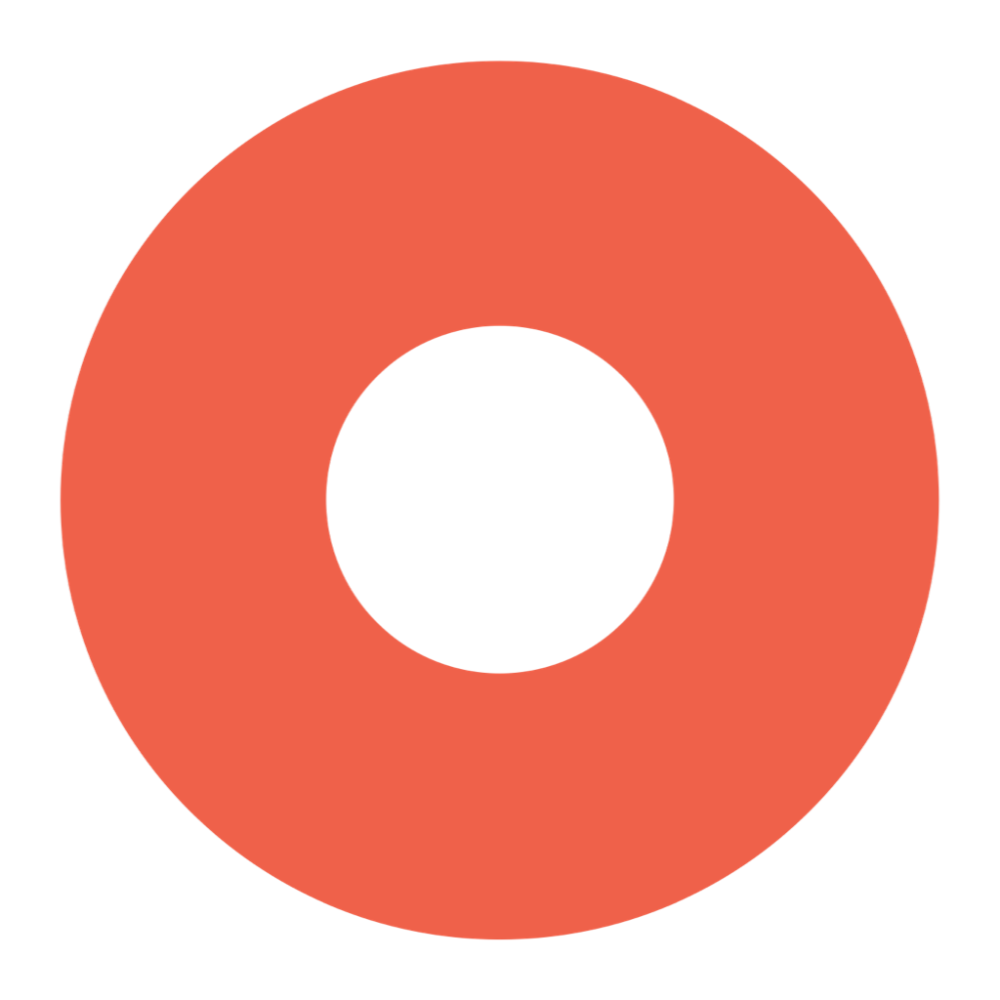

<div align="center">

#  Rokuga

**A free, native, open-source screen recorder for macOS.**

*録画 — "screen recording" in Japanese.*

No watermarks. No time limits. No accounts. No paywalls.

[](LICENSE)
[](https://www.apple.com/macos/)
[](https://swift.org)
[](#project-status)
[](#contributing)

</div>

---

## Why Rokuga?

Commercial screen recorders charge a subscription for what macOS can do natively — and bury it under heavy UIs, launchers, and license nags. Rokuga takes the opposite path:

- **Free forever, Apache 2.0 licensed** — every feature, no strings attached
- **100% native** — Swift + SwiftUI on ScreenCaptureKit, hardware-encoded via VideoToolbox
- **No main window** — a single floating glass toolbar, summoned by a shortcut, that gets out of your way
- **Finder is the library** — recordings save straight to a folder you own; no proprietary library to import from or export out of

## Features

- 🖥️ **Three recording modes** — selected area, full screen, and window
- 🎙️ **Audio capture** — system audio and microphone, individually toggleable
- 🖱️ **Mouse effects** — cursor highlight and click visualization, applied live
- ✂️ **Built-in trim editor** — QuickTime-grammar yellow trim bar, trackpad-native: pinch to zoom the timeline, two-finger scroll to scrub, full mouse parity
- ⚡ **Zero-lag pipeline** — ScreenCaptureKit → VideoToolbox hardware encoding, engineered against explicit performance budgets
- 📸 **Native post-recording flow** — floating thumbnail → preview panel (edit / delete / done), exactly like the system screenshot grammar
- 🫥 **Capture exclusion** — Rokuga's own UI never appears in your recordings
- ⌨️ **Global shortcut** — <kbd>⌘⇧6</kbd> to start/stop by default, fully configurable
- 🎨 **Dark glass UI** — a chic dark-tinted glass theme on the surfaces Rokuga owns; everything else stays purely system-native
- 🌏 **Localized** — English, 한국어, 日本語, 简体中文

## Requirements

- macOS 13.3 (Ventura) or later
- Screen Recording permission (and Microphone, if you record voice)

## Installation

> 🚧 Rokuga is not released yet — it is currently in the design & specification phase. Watch the repo to get notified of the first build.

Planned channels: GitHub Releases (signed & notarized `.dmg`) and Homebrew (`brew install --cask rokuga`).

## Usage

| Action | Default |
| --- | --- |
| Start / stop recording | <kbd>⌘⇧6</kbd> |
| Pause / resume | toolbar · menu bar item |
| Cancel countdown / close preview | <kbd>Esc</kbd> |
| Open last recording | menu bar → *Open Last Recording* |

1. Hit <kbd>⌘⇧6</kbd> — the glass toolbar appears at the bottom-center of your screen
2. Pick a mode (area / full screen / window), toggle audio, and record
3. While recording, the system menu bar shows the state — red dot, elapsed time, pause/stop
4. When you stop, a thumbnail slides in at the bottom-right: click it to preview, trim, delete, or keep

## Project status

Rokuga is being built **spec-first** with [OpenSpec](https://github.com/Fission-AI/OpenSpec): every capability is fully specified and design-reviewed before implementation.

- ✅ Product & UX research
- ✅ 13 capability specs (recording, audio, trimming, performance, permissions, …) — validated `--strict`
- ✅ UI design — 12 mockup sets, native dark glass direction (`design/mockups/`)
- 🚧 Implementation — not started
- ⬜ First public build

## Development

```bash
git clone https://github.com/evan-choi/rokuga.git
cd rokuga

# Generate the Xcode project and build — works out of the box,
# no Apple account or certificate required (ad-hoc signing)
xcodegen generate
open Rokuga.xcodeproj

# Explore the specs
openspec list
openspec show add-core-screen-recording

# Browse the design mockups
open design/mockups/index.html
```

> **Tip for regular contributors:** ad-hoc signing resets macOS privacy
> permissions (Screen Recording, Microphone) on every rebuild. Run
> `./scripts/setup-dev-signing.sh` once to create a local self-signed
> certificate — no Apple ID needed — so permissions persist across builds.

## Contributing

Contributions are welcome! The spec is the source of truth — start by reading the active change under `openspec/changes/`, then open an issue or PR. Spec change proposals are just as valuable as code.

## License

[Apache License 2.0](LICENSE) © Rokuga contributors
