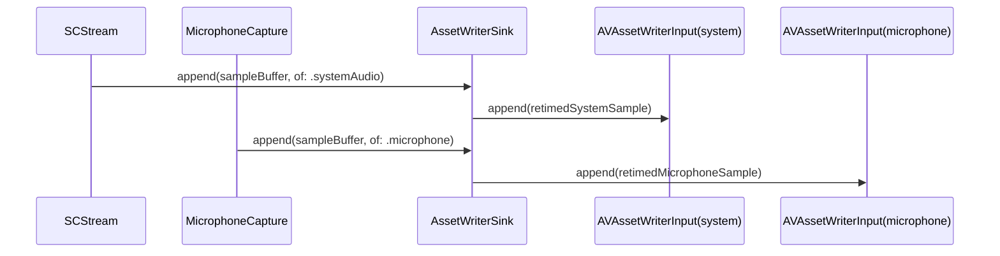

## Context

This document is the implementation contract for adding an optional editing-oriented audio layout without changing the default recording output.

The current capture path already distinguishes `.systemAudio` and `.microphone` samples before `AssetWriterSink`. In Mixed mode, `AssetWriterSink` owns one `AVAssetWriterInput`; `AudioMixer` converts microphone input to 48 kHz stereo and adds it to system audio. Mic-only and system-only recordings write directly to that input. `EncoderConfiguration` snapshots the two source toggles, while `SettingsStore` persists them.

The change crosses SettingsKit, the app settings UI, and EncoderKit. MP4 and MOV both support multiple AAC tracks. Playback still varies by player, so separate tracks remain opt-in and Mixed remains the default.

## Goals / Non-Goals

**Goals:**

- Preserve Mixed as the default and keep its encoded output unchanged.
- Produce independently editable system-audio and microphone tracks when Separate is selected for MP4 or MOV.
- Keep both tracks on the existing recording timeline across start, pause/resume, finish, and cancel.
- Preserve the selected layout when the output container changes.

**Non-Goals:**

- A third pre-mixed playback track alongside the two source tracks.
- Per-source gain, mute automation, monitoring, noise reduction, or post-recording mixing.
- Multiple microphone devices, device selection, disconnect recovery, or a level meter.
- Changing the existing audio bitrate choices or exposing a user-facing track player.

## Decisions

### Keep Mixed as the compatibility default

The product SHALL add `AudioTrackLayout.mixed` and `.separate`, persisted by `SettingsStore`. Missing or unknown values resolve to `.mixed`. `EncoderConfiguration` snapshots the layout at recording start.

The alternatives were keeping mixed output only, making all recordings separate, or adding an option. Mixed-only prevents independent editing. Separate-by-default changes playback behavior for every user. An option preserves current playback while making the editing trade-off explicit.

### Preserve the layout across containers

The Audio settings offer Separate for MP4 and MOV. Changing the container preserves the persisted layout, and `EncoderConfiguration` snapshots it without container-specific normalization. `AssetWriterSink` uses the same separate-input routing for both `AVFileType.mp4` and `AVFileType.mov`.

### Reuse the existing source routing

`AssetWriterSink` SHALL select its audio inputs once in `start()`:

- Mixed with any enabled source: one audio input; both sources continue through the existing direct/mixer paths.
- Separate with both sources: one system input and one microphone input; `AudioMixer` is not created.
- Either layout with one enabled source: one input for that source.
- No enabled source: no audio input.

Separate mode retimes each incoming sample and appends it only to its matching input. It does not copy samples between tracks or add a new capture queue.

### Share splice timing and lifecycle ownership

The sink remains the owner of every writer input. Both separate paths use the existing source PTS and the same accumulated pause offset from `SpliceClock`. The first sample after resume establishes the shared offset; later samples from either source use that offset.

`start()` creates and validates all required inputs before `AVAssetWriter.startWriting()`. If any input cannot be added, start fails and the sink removes the output. `finish()` marks video and every created audio input finished before `finishWriting()`. `cancel()` cancels the writer and removes the partial file. A source that stops delivering samples does not block the remaining source or finalization.

### Use stable track identity and per-track bitrate

When both separate tracks exist, the writer adds system audio first and microphone second. Each input receives locale-neutral title metadata: `System Audio` or `Microphone`. MOV preserves those titles. AVAssetWriter drops per-track title metadata from MP4, so deterministic order is the MP4 identity contract and remains the fallback for editors that do not expose MOV titles.

The selected AAC bitrate applies to each separate track. A two-track file can therefore use approximately twice the audio bitrate of the equivalent Mixed recording. Splitting one bitrate between tracks would reduce quality and make the existing bitrate setting misleading.

### Keep the option in Audio settings

Track layout belongs in Settings › Audio, not the recording toolbar. The toolbar keeps source toggles; layout is an output/editing preference. The control is disabled during active recording and snapshots only at the next start. Player-compatibility guidance comes from the String Catalog in all shipping languages.

## Risks / Trade-offs

- [Some players play only one audio track] → Keep Mixed as default and describe Separate as editing-oriented.
- [Separate output is larger] → State that the selected bitrate applies per track; do not silently lower either source's quality.
- [An editor ignores title metadata] → Write tracks in deterministic system-then-microphone order.
- [MP4 drops per-track title metadata] → Use deterministic order instead of adding a post-processing muxer.
- [One audio input backpressures independently] → Check readiness per input and test that one source does not route into or block the other source's track.
- [Existing and new settings drift] → Make `AudioTrackLayout` and the effective-layout rule the single core contract used by the UI snapshot and writer.

## Migration Plan

No file migration is required. Existing installations have no layout key and resolve to Mixed. Existing recordings are unchanged. Rollback ignores the new preference key and continues producing mixed files; recordings already produced with separate tracks remain standard MP4 or MOV files.

## Verification

- Settings tests cover the Mixed default, persistence, reset, and container-independent layout.
- Asset-writer integration tests inspect zero, one, mixed, and separate output track counts and order for MP4 and MOV, plus titles for MOV.
- Source-isolation fixtures give system and microphone buffers distinct signals and verify each decoded separate track contains only its source.
- Pause/resume integration verifies that both separate tracks use the same splice duration and remain aligned with video.
- Start-failure and cancel tests verify that partial files are removed.
- SwiftLint, SwiftFormat, localization completeness, unsigned app build, and `openspec validate add-separate-audio-tracks --strict` must pass.

## Open Questions

None.
